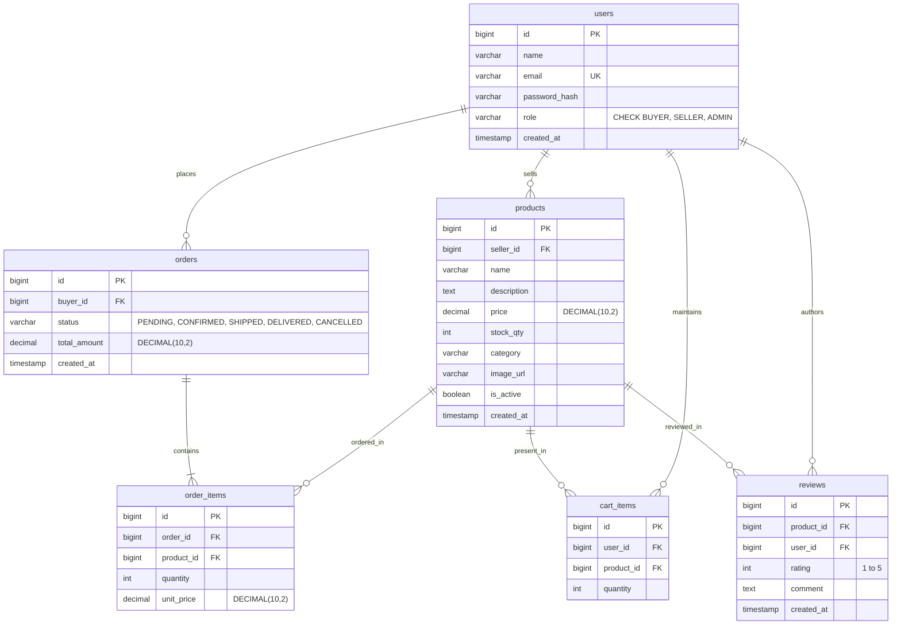
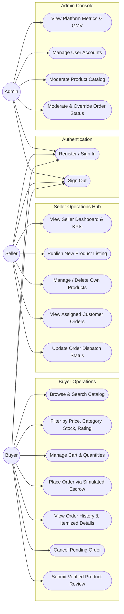
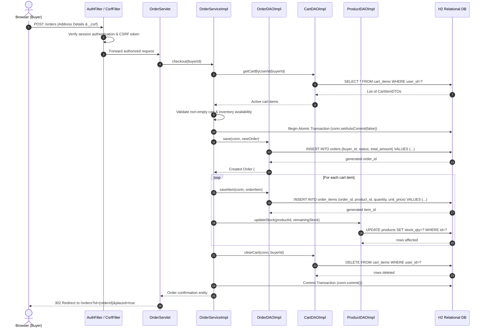

# PalaniMart — Multi-Seller E-Commerce Marketplace

**Anna University R2025 Semester 3 Capstone Project**  
*Technology Stack: Java Servlets 4.0 · Raw JDBC · Apache Tomcat 9.0.x · H2 Database · JSP 2.3 & JSTL 1.2*

---

## 1. Project Overview

**PalaniMart** is an enterprise-grade, native multi-seller e-commerce marketplace built strictly with standard Java EE / Jakarta EE fundamentals (Servlet 4.0, JSP/JSTL, raw JDBC with HikariCP, and H2 Database). It enables independent sellers to publish and manage product listings, buyers to browse, search, manage shopping carts, and place orders via simulated escrow payment, and platform administrators to govern users, catalog creations, and platform transactions.

### Key Architectural Constraints
- **Zero Heavy Frameworks**: Pure Java EE Servlets, JSP/JSTL, and raw JDBC via HikariCP (No Spring Boot, Hibernate, JPA, React, or Node.js).
- **Relational Database**: H2 Database running in server mode for live deployment and embedded in-memory mode for automated testing.
- **Transactional Integrity**: Multi-table atomic checkout transactions (`conn.setAutoCommit(false)`, `conn.commit()`, `rollbackTransaction`) ensuring zero stock inconsistency.
- **Security-First Engineering**: BCrypt password hashing (cost factor 12), session fixation defense via session ID regeneration, strict XSS escaping via JSTL `<c:out>`, CSRF protection across all state-changing endpoints, and parameterized PreparedStatement execution everywhere.
- **PalaniMart UI**: A peacock-green, rani-pink and zari-gold design system built around a temple-border (korvai) motif, with Baloo Thambi 2 and Hind Madurai type (both support Tamil), fully responsive across mobile, tablet, laptop, and desktop.

---

## 2. Technology Stack

| Layer / Component | Technology & Version | Description |
| :--- | :--- | :--- |
| **Language & Runtime** | Java 17 LTS | OpenJDK 17 / 21 LTS |
| **Servlet Container** | Apache Tomcat 9.0.x | Java EE 8 Servlet 4.0 API (`javax.servlet.*`) |
| **Build & Packaging** | Apache Maven 3.9+ | WAR packaging and dependency lifecycle |
| **Database** | H2 Database 2.2.x | Server mode (deploy) & In-memory mode (tests) |
| **Connection Pooling** | HikariCP 5.1.x | Managed strictly by `AppContextListener` |
| **Presentation** | JSP 2.3 + JSTL 1.2 | Server-rendered views with layout decoupling |
| **Client Scripting** | Vanilla JavaScript | Asynchronous `fetch()` calls and toast notifications |
| **JSON Serialization** | Google Gson 2.10.x | API request/response serialization |
| **Password Security** | jBCrypt 0.4 | Salted BCrypt password hashing (cost 12) |
| **Logging** | SLF4J 2.0 + Logback 1.5 | Structured logging with MDC `requestId` tracing |
| **Testing** | JUnit 5 + Mockito 5 | DAO tests on embedded H2, Service tests with mocks |
| **Continuous Integration** | GitHub Actions | Ubuntu runner executing `mvn -B clean verify` |

---

## 3. System Architecture

```mermaid
flowchart TD
    Client["Browser / Client (HTML5, CSS design tokens, Vanilla JS Fetch)"]
    
    subgraph Security_Filter_Pipeline ["Security & Filter Pipeline"]
        F1["EncodingFilter (UTF-8)"]
        F2["LoggingFilter (UUID Request ID -> SLF4J MDC)"]
        F3["CsrfFilter (Token Verification & Security Headers)"]
        F4["AuthFilter (Session Check & RBAC: Buyer / Seller / Admin)"]
    end

    subgraph Controller_Layer ["Controller / Servlet Layer"]
        S_Auth["AuthServlet (/login, /register, /logout)"]
        S_Prod["ProductServlet (/products, /product, /api/products)"]
        S_Cart["CartServlet (/cart, /api/cart)"]
        S_Order["OrderServlet (/checkout, /orders, /api/orders)"]
        S_Review["ReviewServlet (/reviews, /api/reviews)"]
        S_Seller["SellerServlet (/seller/*, /api/seller/*)"]
        S_Admin["AdminServlet (/admin/*, /api/admin/*)"]
        S_Chat["ChatServlet (/chat, /api/chat)"]
    end

    subgraph Service_Layer ["Service Layer (Business Rules & Transactions)"]
        Svc_User["UserService / AuthServiceImpl"]
        Svc_Prod["ProductServiceImpl"]
        Svc_Cart["CartServiceImpl"]
        Svc_Order["OrderServiceImpl (ACID Checkout)"]
        Svc_Review["ReviewServiceImpl"]
    end

    subgraph DAO_Layer ["DAO Layer (PreparedStatement & Raw JDBC)"]
        DAO_User["UserDAOImpl"]
        DAO_Prod["ProductDAOImpl"]
        DAO_Cart["CartDAOImpl"]
        DAO_Order["OrderDAOImpl"]
        DAO_Review["ReviewDAOImpl"]
    end

    subgraph Persistence ["Persistence Layer"]
        Pool["HikariCP Connection Pool (AppContextListener)"]
        DB["H2 Relational Database"]
    end

    Client --> Security_Filter_Pipeline
    Security_Filter_Pipeline --> Controller_Layer
    Controller_Layer --> Service_Layer
    Service_Layer --> DAO_Layer
    DAO_Layer --> Pool
    Pool --> DB
```



---

## 4. Key Diagrams

### A. Entity-Relationship Diagram (ERD)



### B. Use Case Diagram



### C. Place Order Transactional Sequence Diagram



---

## 5. REST & JSON API Overview

| Method | Endpoint | Access | Description |
| :--- | :--- | :--- | :--- |
| `POST` | `/api/v1/auth/register` | Public | Register new user account (`BUYER` / `SELLER`) |
| `POST` | `/api/v1/auth/login` | Public | Authenticate user and establish secure session |
| `POST` | `/api/v1/auth/logout` | Authenticated | Invalidate session |
| `GET` | `/api/products` | Public | Paginated product search, category filter & sorting |
| `GET` | `/api/products/{id}` | Public | Inspect single product details |
| `GET` | `/api/cart` | Authenticated | Retrieve current user's active shopping cart |
| `POST` | `/api/cart/add` | Authenticated | Add product to shopping cart |
| `PUT` | `/api/cart/items/{id}` | Authenticated | Update quantity of a cart line item |
| `DELETE`| `/api/cart/items/{id}` | Authenticated | Remove line item from shopping cart |
| `GET` | `/api/orders` | Authenticated | Retrieve authenticated user's order history |
| `GET` | `/api/orders/{id}` | Authenticated | Retrieve itemized details for an authorized order |
| `POST` | `/api/orders` | Authenticated | Execute atomic checkout transaction |
| `POST` | `/api/orders/{id}/cancel` | Authenticated | Cancel a pending or confirmed order |
| `GET` | `/api/reviews?productId={id}` | Public | List customer reviews for a product |
| `POST` | `/api/reviews` | Buyer | Submit a verified customer review |
| `GET` | `/api/seller/dashboard` | Seller | Retrieve seller KPI metrics and sales revenue |
| `GET` | `/api/seller/products` | Seller | List catalog products owned by authenticated seller |
| `POST` | `/api/seller/products` | Seller | Publish a new product listing |
| `PUT` | `/api/seller/products/{id}` | Seller | Update an existing product listing |
| `DELETE`| `/api/seller/products/{id}` | Seller | Delete an existing product listing |
| `PUT` | `/api/seller/orders/{id}/status` | Seller | Update shipping status for assigned order |
| `GET` | `/api/admin/dashboard` | Admin | Retrieve platform metrics and marketplace GMV |
| `GET` | `/api/admin/users` | Admin | List all registered user accounts |
| `GET` | `/api/admin/orders` | Admin | List platform orders for administrative moderation |
| `PUT` | `/api/admin/orders/{id}/status` | Admin | Administrative order status override |
| `POST` | `/api/chat` | Public | Assistant chatbot endpoint |

### Standard Response Envelopes

**Success Envelope:**
```json
{
  "success": true,
  "message": "Operation completed successfully",
  "data": { ... }
}
```

**Error Envelope:**
```json
{
  "success": false,
  "errorCode": "VALIDATION_ERROR",
  "message": "Detailed error description"
}
```

---

## 6. Seed Accounts (Development & Testing)

| Role | Email | Password | Permissions |
| :--- | :--- | :--- | :--- |
| **ADMIN** | `admin@palanimart.com` | `admin123` | Platform console, user governance, order moderation |
| **SELLER** | `seller1@palanimart.com` | `seller123` | Seller hub, inventory management, order dispatch |
| **SELLER** | `seller2@palanimart.com` | `seller123` | Seller hub (BookWorld Store listings) |
| **BUYER** | `buyer1@palanimart.com` | `buyer123` | Catalog browse, shopping cart, checkout, reviews |
| **BUYER** | `buyer2@palanimart.com` | `buyer123` | Catalog browse, shopping cart, checkout, reviews |

---

## 7. Local Setup, Build & Deployment

### Prerequisites
- **Java**: OpenJDK 17 LTS (or JDK 21 LTS) installed and configured on `PATH`.
- **Maven**: Apache Maven 3.9+ (or `mvnd` / `./mvnw`).
- **Servlet Container**: Apache Tomcat 9.0.x.

### Build & Verification Commands
```bash
# 1. Clean, compile, and execute all 148 automated tests
mvn clean verify

# 2. Package production WAR file
mvn clean package -DskipTests
```
The packaged deployable WAR will be created at `target/palanimart.war`.

### Running with Embedded Tomcat (Development & Testing)
Automated tests automatically launch embedded Apache Tomcat 9 at `http://localhost:8888/palanimart` during test suite execution.

### Deploying to Standalone Apache Tomcat 9
1. Copy `target/palanimart.war` to `$CATALINA_HOME/webapps/palanimart.war`.
2. Start Tomcat:
   - Linux/macOS: `$CATALINA_HOME/bin/startup.sh`
   - Windows: `%CATALINA_HOME%\bin\startup.bat`
3. Access the web application in any browser at:  
   `http://localhost:8080/palanimart/`
# PrakashMart

