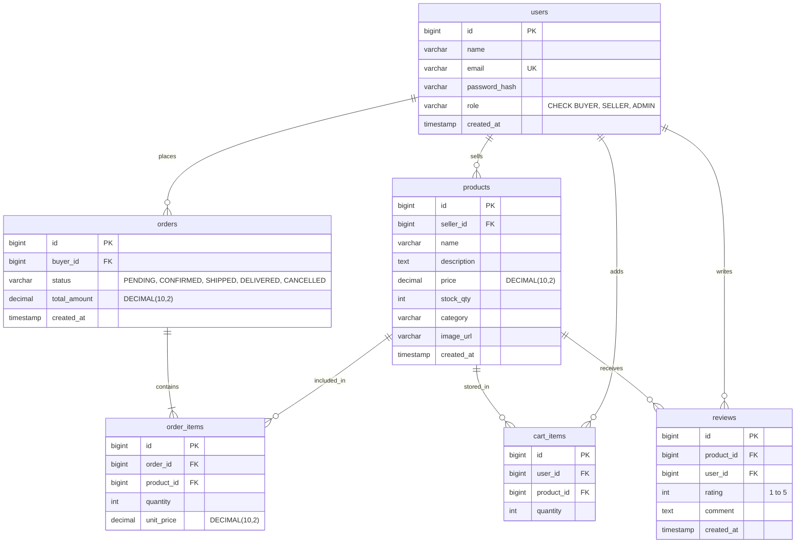

# D1: Entity-Relationship Diagram (ERD)

Derived from Section 4 (Database Design Specification) of the Capstone Project Requirements.

```mermaid
erDiagram
    users ||--o{ products : "sells"
    users ||--o{ orders : "places"
    users ||--o{ cart_items : "adds"
    users ||--o{ reviews : "writes"
    products ||--o{ order_items : "included_in"
    products ||--o{ cart_items : "stored_in"
    products ||--o{ reviews : "receives"
    orders ||--|{ order_items : "contains"

    users {
        bigint id PK
        varchar name
        varchar email UK
        varchar password_hash
        varchar role "CHECK BUYER, SELLER, ADMIN"
        timestamp created_at
    }

    products {
        bigint id PK
        bigint seller_id FK
        varchar name
        text description
        decimal price "DECIMAL(10,2)"
        int stock_qty
        varchar category
        varchar image_url
        timestamp created_at
    }

    orders {
        bigint id PK
        bigint buyer_id FK
        varchar status "PENDING, CONFIRMED, SHIPPED, DELIVERED, CANCELLED"
        decimal total_amount "DECIMAL(10,2)"
        timestamp created_at
    }

    order_items {
        bigint id PK
        bigint order_id FK
        bigint product_id FK
        int quantity
        decimal unit_price "DECIMAL(10,2)"
    }

    cart_items {
        bigint id PK
        bigint user_id FK
        bigint product_id FK
        int quantity
    }

    reviews {
        bigint id PK
        bigint product_id FK
        bigint user_id FK
        int rating "1 to 5"
        text comment
        timestamp created_at
    }
```
