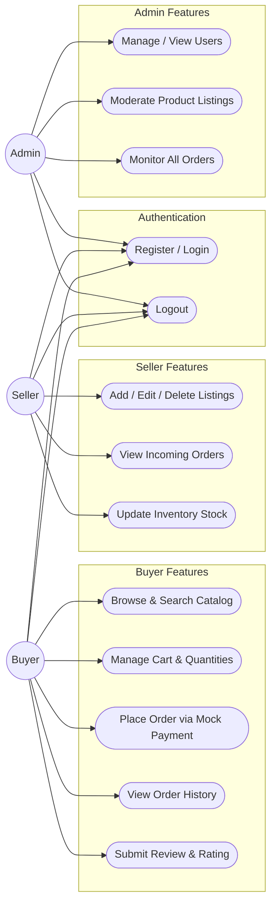

# D2: Use Case Diagram

Derived from Section 1 (Feature Requirements F1–F8) of the Capstone Project Requirements.

```mermaid
flowchart LR
    Buyer((Buyer))
    Seller((Seller))
    Admin((Admin))

    subgraph Authentication
        UC1([Register / Login])
        UC2([Logout])
    end

    subgraph Buyer_Features["Buyer Features"]
        UC3([Browse & Search Catalog])
        UC4([Manage Cart & Quantities])
        UC5([Place Order via Mock Payment])
        UC6([View Order History])
        UC7([Submit Review & Rating])
    end

    subgraph Seller_Features["Seller Features"]
        UC8([Add / Edit / Delete Listings])
        UC9([View Incoming Orders])
        UC10([Update Inventory Stock])
    end

    subgraph Admin_Features["Admin Features"]
        UC11([Manage / View Users])
        UC12([Moderate Product Listings])
        UC13([Monitor All Orders])
    end

    Buyer --> UC1
    Buyer --> UC2
    Buyer --> UC3
    Buyer --> UC4
    Buyer --> UC5
    Buyer --> UC6
    Buyer --> UC7

    Seller --> UC1
    Seller --> UC2
    Seller --> UC8
    Seller --> UC9
    Seller --> UC10

    Admin --> UC1
    Admin --> UC2
    Admin --> UC11
    Admin --> UC12
    Admin --> UC13
```
