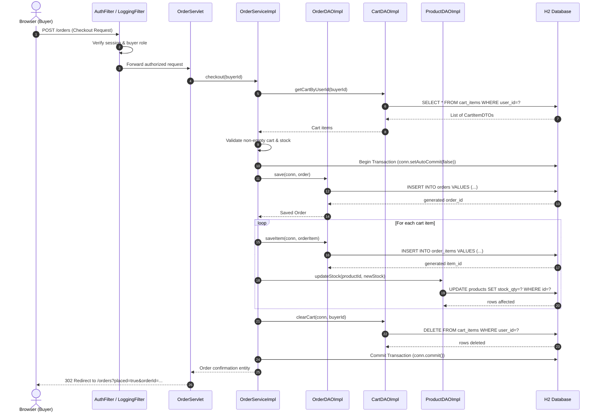

# D3: Sequence Diagram — Place Order Flow

Derived from Section 2 & Section 5 of the Capstone Project Requirements:
Flow: `Browser -> Servlet -> Service -> DAO -> Database`, including transactional checkout and response path.

